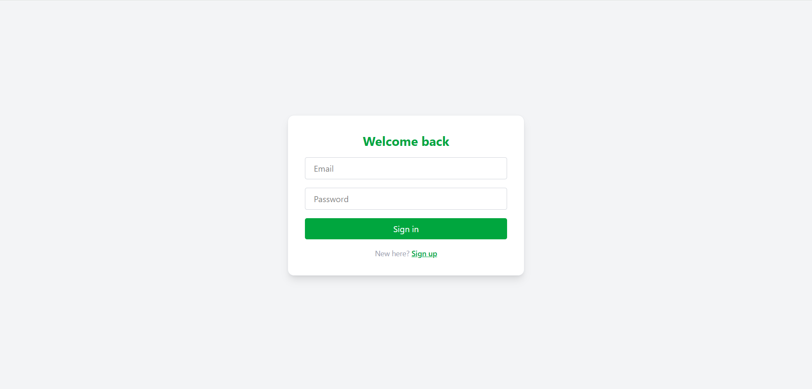

# Chat Application 💬

A chat application built with Next.js, Tailwind CSS, TypeScript, and Supabase. It supports real-time one-on-one messaging with a clean interface.

## 🚀 Features

- ✅ One-on-one real-time messaging
- ✅ Authentication with Supabase
- ✅ WhatsApp-like chat interface
- ✅ Chat list and message view separation
- ✅ Supabase real-time subscriptions for new messages

## 🛠 Tech Stack

- **Frontend:** Next.js, TypeScript, Tailwind CSS
- **Backend:** Supabase (Database + Auth + Realtime)

## 📸 Screenshots

### Login Page



### Message View


## 🔗 Live Demo

https://chat-application-xi-livid.vercel.app/

## 🧑‍💻 Getting Started

To run this project locally:

1. Clone the repository:
```bash
   git clone https://github.com/munzirc/chat-application.git
   cd chat-application
```
2. Install dependencies:
```bash
   npm install
```
3. Set up environment variables
    1. Create a .env.local file (refer .env.example)
    2. Add your Supabase credentials:
```bash
    NEXT_PUBLIC_SUPABASE_URL=your_supabase_url
    NEXT_PUBLIC_SUPABASE_ANON_KEY=your_anon_key
```
4. Start the development server:
```bash
   npm run dev
```
server runs at http://localhost:3000

✨ Future Improvements
  Group chats

  Message seen status

  Typing indicators

  File sharing
